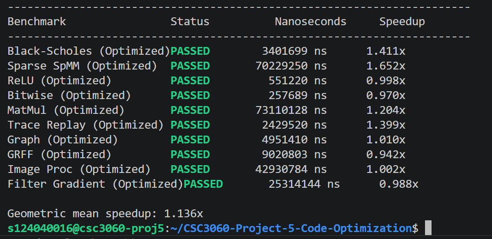
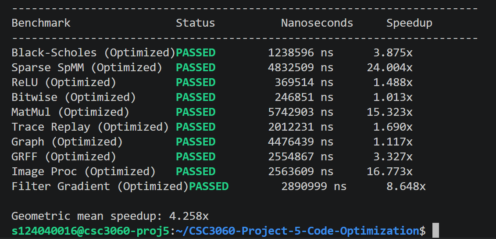

## Team Information
- Bryan Edelson - 124040016
- Geoffrey Mikhael - 124040051

Grading distrubution: same score for both of us

## Note
Please note that we did not try to mitigate page fault impacts here. So, at times, the first iteration of each kernel might have significantly slower execution time. This makes the average execution time of each kernel slower (even slower than baseline for some). We hope the grader will evaluate our kernels multiple times.

For some codes, there will be an `#if 1` wrapper, which indicates which part we actually use. Please ignore ones that have `#if 0`.

## Basic Implementation
Final result:


### bitwise.cpp
Immediately after seeing how the naive implementation performs the task (one int8 for each iteration), the first approach is to just combine multiple int8 as one big integer. So, this is exactly what I did by using uint128_t (or int128_t, it doesn't matter because no right shift operations).
- Load 16 consecutive elements from vector a and b, i.e., $16\times8=128$ bits of data as an int128_t value. I used `memcpy` for this.
- Just do the same bitmask operations like naive version, but with 16-times repeated mask:
```cpp
    constexpr __uint128_t kMaskLoP128 = (__uint128_t)0x5A5A5A5A5A5A5A5A << 64 | 0x5A5A5A5A5A5A5A5A;
    constexpr __uint128_t kMaskHi128 = (__uint128_t)0xC3C3C3C3C3C3C3C3 << 64 | 0xC3C3C3C3C3C3C3C3;
```
- And there will be some leftovers to handle if the length of vector a and b is not perfectly divsiible by 16.

The implementation above is already okay and is within the baseline speed already. But, after discussing with some of my friends (also credits to them!), there is actually an equivalent expression of the bitmask operations performed:
- There are 3 masks used:
```cpp
    constexpr __uint128_t mask1 = (__uint128_t)0x8181818181818181 << 64 | 0x8181818181818181;
    constexpr __uint128_t mask2 = (__uint128_t)0x1818181818181818 << 64 | 0x1818181818181818;
    constexpr __uint128_t mask3 = (__uint128_t)0x2424242424242424 << 64 | 0x2424242424242424;
```
- The equivalent operation is:
```cpp
    __uint128_t either = ap | bp;
    __uint128_t res = ((~either) & mask1) | (either & mask2) | (mask3);
```
- The execution time remained similar though. But, I decided to just leave it out because it was nice to see an equivalent expression for it.

### relu.cpp
First, the objective is literally to perform $\max(0,a)$. Well, I know that `std::max()` exists, and is probably optimized already by the compiler, so using this was a no-brainer. This is what I ended up using for the final implementation.

But, I also tried to explore how to maybe use bitmask operations to do this. Let $a$ be the input number.
- First thought is that It's probably something to do with the sign bit.
- Case 1: if $a\geq0$, then the sign bit is $0$. The objective is to retain the value of $a$. So, by forcing myself to use the sign bit as a mask, what I did was just try to perform a logical right shift and make the masking bits to be all 0.
- Case 2: if $a<0$, then the sign bit is $1$. The objective is to make the final value of $0$. By doing logical right shift on the sign bit mask, the mask becomes all 1.
- Then, the final operation of $\&$ (logical and) is perfect to handle this. Just make the negate the mask and so if the mask is all 1, then the value is retained. If the mask is all 0, the final value becomes zero.
- Thus, the final expression is: `a & ~(a >> 31)`.
- Since the input is a float (32 bits), all I had to do was just try to directly operate on its bits by making a reference to it, which can be done by `*(int32_t*)&a` (typecast the address of $a$ as an integer pointer, and then dereference it to be stored as a `int32_t&`).
- The speedup was similar to `std::max()`, and most importantly is still within the baseline value.

However, in the end, I decided to just go for `std::max()`.

### matmul.cpp
The matrix is represented as a 1D vector, and so entry $(ij)$ can be accessed by indexing with $i\times n+j$, where $n$ is the row size of the matrix. The operation $C_{ij}$ += $A_{ik}\times B_{kj}$ is the bottleneck here.
- First, accessing $C_{ij}$ is actually okay, because the loop structure is $i,j,k$, so accessing it is contiguous because it is indexed by $i\times n+j$, and the access pattern is $0,1,2,\ldots,n^2-1$.
- Second, accessing $A_{ik}$ is also okay because it is also contiguous. For a fixed $i$ the access pattern is $i\times n,i\times n + 1,\ldots,i\times n + (n-1)$. However, the temporal locality here can be poor here. For each $j$, there are $2n$ accesses (excluding $C$). But, $A_{ik}$ will be reused for each $j$, and there might be a chance that $A_{ik}$ is already evicted.
- The problem lies in how $B_{kj}$ is accessed. For a fixed $j$, the access pattern is $j,n+j,2n+j,\ldots,(n-1)n+j$, i.e., it has to jump to a new row for each iteration of $k$. Jumping between these addresses are computationally more expensive. Furthermore, for each $i$, the number of accesses are $2n^2$. But, $B_{kj}$ will be reused again in the future for each subsequent row. There might be a chance that $B_{kj}$ is already evicted from the cache because the number of accesses from previous row. This has poorer temporal locality than acceses of $A$.

So, the first thing I did was to tranpose $B$, i.e., let $B^\intercal_{ij}=B_{ji}$. The computational cost is $O(n^2)$ here, which at first I thought was going to be okay when compared to the overall $O(n^3)$. By storing $B^\intercal$, I can now access $B_{kj}$ by accessing $B^\intercal_{jk}$ instead, which can be indexed by $j\times n + k$. For a fixed $j$, the access pattern is contiguous, $j\times n,j\times n + 1,\ldots, j\times n + (n-1)$.

Unfortunately after testing, although it was very close, the execution time still does not meet the baseline requirement. It's most likely due to the poor temporal locality still being there and the $O(n^2)$ small overhead of tranposing B.

Here, what I did was to try to have a similar access pattern without actually transposing $B$ and potentially improve temporal locality. What I did was to transform the loop into a $i,k,j$ loop:
- Accessing $C_{ij}$ still the same. But now, it is possible to update multiple $j$'s (columns) at once, allowing for a SIMD-like technique or explicit loop unrolling.
- For $A_{ik}$, the spatial locality is still the same (still contiguous), but now $A_{ik}$ can be stored as a variable and reused across all $j$ in the most-inner loop. This improves its temporal locality.
- For $B_{kj}$, for a fixed $k$, the access pattern is now $k\times n,k\times n +1,\ldots,k\times n + (n - 1)$, which is now contiguous. Still however, for the next subsequent $i$ (row), $B_{kj}$ will be reused. This approach still does not completely fix the poor temporal locality, but now that $A_{ik}$ has great temporal locality, it also lessens the amount of accesses per row, and so, eviction of $B_{kj}$ is less likely to happen.

The $i,k,j$ loop approach successfully beat the baseline time, and this is the final implementation for this kernel. I also did manual loop unrolling to speed it up a bit.

### trace_replay.cpp
Immediately, the naive version does this:
```cpp
records[trace[i]]
```
which accesses records at random indices defined by `trace[i]`. This is poor spatial locality. Each access may pull an entire cache line just for one record indexed by `trace[i]`. It's basically wasting bandwidth to load adjacent unused records.

So, at first, I tried to do prefetching:
```cpp
__builtin_prefetch(&records[trace[i + dist]], 0, 2)
```
I tried different values of `dist`. I forgot the exact value of `dist` that achieved the best result for me. But, it was within the baseline already.

Additionally, I observed that the function `trace_replay_cost()` is called repeatedly in the trace loop. The naive version requires it to recompute the cost everytime, but there may be some records that appear multiple times in the trace. So, it's better to have some sort of lookup table for better temporal locality.

So, what I did further was to:
- Iterate through `records` sequentially. This promotes good spatial locality.
- Precompute all possible `trace_replay_cost` of `records`. The tradeoff is that it requires additional $O(\text{records.size()})$ space.
- Now, when iterating through the trace, `cost[trace[i]]` can be acccessed in $O(1)$ time.

I removed prefetching and ended up just using the optimization above as a standalone. The reason was because:
- The execution time is still well above the baseline for the basic task. There was barely a difference in execution time too.
- I am letting the compiler prefetch instead by using custom flags for the bonus part later.

### graph.cpp
Because the old graph uses pointers in its representation, of course, it will naturally be slow.

I made a new representation of the graph:
```cpp
std::vector<int> offsets; // size n + 1
std::vector<int> edge_dests; // size m
```
Denote $n$ as the number of nodes and $m$ as the number of edges. Here:
- `offsets[i]` denotes the index at `edge_dests` of the first edge of node $i\in\{0,\ldots,n-1\}$. There is an additional entry at the end with value of $m$ for traversal purposes. All indices starting from `offsets[i]` until `offsets[i + 1] - 1` basically denote the edges of node $i$. 
- `edge_dests[j]` denotes which node edge $j$ points to, i.e., its destination.

This new representation allows the traversal to be done contiguously and thus improves cache locality tremendously.

I believe the conversion is trivial and doesn't need to be discussed. It is easily done by traversing the naive graph structure.

Now, to utilize the optimized graph structure, traversal of the graph can now be done like this:
```cpp
for (int u = 0; u < graph.n; u++)
    for (int e = offsets[u]; e < offsets[u + 1]; e++) // reason why offsets size is n + 1
```
The loop here has good locality compared to the naive one. After doing explicit loop unrolling and prefetching the next cache line, this implementation is perfectly within the baseline time. This is much faster than the naive version that had a time of around 0.3x-0.4x of the baseline.

### grff.cpp
For this part, the consideration was:
- Basically try to identify what computations can be combined into one loop. 
- Try to minimize the use of `std::vector` as a storage. It's better to recompute the value using registers (fast storage).

The final implementation is that I used one vector for `A_prime` (I named it as `A` in my code). It's actually possible to use no vectors at all, but I found that it is slower. This is because `A` is required here:
```cpp
(A[i] + A[i - 1]) * 0.5f;
```
Without a vector, I would need to recompute `A` for both the current iteration and previous iteration, which results in computation redudancy. So, it's better to just precompute and store in a vector.

### sparse_spmm.cpp
`perf` showed that accessing `bt_row[csr.col_idx[p]]` had 70% miss rate (likely because `csr.col_idx[p]` gives values that jump around), so the problem lies in this line. Accesses to sparse matrix don't usually cause cache misses because the CSR format made the data sequential and contiguous so we focus on improving the random stride access of `bt_row`. One way is to increase reuse of the `bt_row` after we loaded it into memory, so that we atleast benefit from the miss overhead.
- `bt_row` is the column of dense matrix B, this needs to be multiplied (dot product) with every row in A to produce a value in the resulting matrix
- naive implementation iterates through rows of A first then loads `bt_row`, loading multiple columns of B to multiply with a row of A. Each load of `bt_row` accesses the `bt_row[k]` with a `k` that is not sequential because it jumps according to the location of A's nonzero values given by the CSR format
- thus our initial accesses to `bt_row` are likely all cache misses since the strides are likely not cache-friendly so that's why we better not trigger these misses again in the future by reusing the `bt_row` loaded and iterating over all rows of A
- our implementation iterates through dense_cols of B first then rows of A, because we have already paid the random access memory load price for `bt_row` once and want to maximize using it before we throw it away
- we keep `bt_row` (the column of dense matrix B) in cache while we perform dot product with all rows of A, this doesn't necessarily cause cache misses when accessing rows of A since the CSR format stores values contiguously
- this implementation is much better because otherwise one row of A would trigger a lot of `bt_row` cache misses, then the next row of A also does the same, and it even reloads `bt_row` that was possibly evicted out of the cache. Such a waste

### image_proc.cpp
there are many function calls here and the task is to inline when possible, especially since they are called within a nested loop so that means a lot of function call overhead. Systematically inlining, one by one, reveals that inlining all the functions gave the best performance. This aligns with the theory learned in lecture.
- some functions are so small that their overhead is doing much more work than the actual computation, so better inline
- nested function calls like `y = f(g(h(x)))` cause a lot of overhead per function (especially when we're calling this nested expression in every iteration of the loop), inlining them reduces this and provides opportunities for more optimization by the compiler such as vectorization (given we perform same operations for all indices) or other techniques
- although some functions are big and complex, they are only called once within the loop body so inlining doesn't hurt that much but actually gives better performance when tested on real hardware
- maybe if the functions are super large that they affect I-cache of the loop too drastically and give little benefit, or if they are called many times within the same loop body (causing inlining to bloat the code), then inlining them might not be worth it
- our inlined functions are also called very frequently (cause of loop) so they did benefit from inlining, maybe for those rarely used large functions we better stay away from inlining them, otherwise the code bloat outweighs the performance gain

### filter_gradient.cpp
the problem here is the cache misses caused by data arrangement. Original SoA format places each channel of the image super far away from each other and inside the loop we access all channels at an index.
- this means accessing each channel would have high chance of being a cache miss and this happens to all channels
- reformatting the data into AoS format as an array of `struct pixel`s (each containing index `i` of all channels) helps bring the channels contiguously near each other when we access index `a[i]` of the AoS so that we just need to trigger one miss for `a[i]` and all other channels at that index `i` are available to us

### blackscholes.cpp
this kernel's optimization lie mainly in simplifying or approximating the mathematical expressions but it's really hard.
- first, I noticed that there was a long chain of data dependence so I transformed it in a way that would allow the compiler to maybe parallelize it in someway. This did speed up a little bit approximately from 0.6x to 0.8x
    ```cpp
    // before
    float local = k * coefficient_a1;
    local += k_2 * coefficient_a2;
    local += k_3 * coefficient_a3;
    local += k_4 * coefficient_a4;
    local += k_5 * coefficient_a5;
    local = 1.0f - local * xNPrimeofX;
    
    // after
    float local = k * coefficient_a1
    + k_2 * coefficient_a2
    + k_3 * coefficient_a3
    + k_4 * coefficient_a4
    + k_5 * coefficient_a5;
    local = 1.0f - local * xNPrimeofX;
    ```
- all operations were done in `float` so I tried to add `f` suffixes to the macros and the speedup got to 1x
- then I learned about Horner polynomial expressions and how it can really reduce the number of multiplications we have been doing for `k, k*k, k*k*k, ...` and tried that
    ```cpp
    const float k = 1.0f / (1.0f + p_val * x);

    // k(a_1 + k(a_2 + k(a_3 + k(a_4 + k(a_5)))))
    float poly = coefficient_a5;
    poly = poly * k + coefficient_a4;
    poly = poly * k + coefficient_a3;
    poly = poly * k + coefficient_a2;
    poly = poly * k + coefficient_a1;
    poly = poly * k;
    ```
- for the student CNDF function I also didn't understand why we were overwriting a referenced value instead of returning so I tried returning a value and it got faster. I'm not sure how C++ handles references as compared to pointers but maybe aliasing or load/store could have a role that affected the speed previously
- also, doing `xD1/xDen` after computing `xD1` is somehow slow. Replacing it by multiplying `invXDen` while computing final value of `xD1` is faster by a bit maybe because of scheduling dependencies
- the naive way used `inline` keyword for helpers so I also used that, and without it, the speedup got worse. So I guess inlining can help the compiler see more opportunities of what to optimize, also since we're calling the helper functions multiple times because of loop, minimizing the function overhead is a good thing
- for approximating `exp, log` using Taylor series I naively tried replacing them with four terms of the series and the output was totally wrong, so I tried more terms and still not good. I gave up on this approach but realized one part of the code had `exp(-rate*time)` where `rate, time` ranges `[0.0275,0.1], [0.1,1]` respectively and thus their product magnitude is close to zero. Finally, I can use an easy way to approximate using Taylor series but I still give up on other ones because I really have no idea
    ```cpp
    // this is the taylor series of e^x but I expressed the polynomial using Horner since it is amazing to reduce the number of multiplications
    return 1.0f + x * (1.0f + x * (0.5f + x * ((1.0f / 6.0f) + x * ((1.0f / 24.0f) + x * (1.0f / 120.0f))))); 
    // also is an inline function for the same reasons of optimization
    ```
- I asked around for any more optimization techniques that I could understand and that actually work and one that worked is called Put-call Parity though I can't really understand why it's true since I don't do options trading analysis. Anyway, using this formula the speedup increased by 1x. Even though I didn't need to make this optimization, just wanted to make the speedup attain a nice looking number (1.4x instead of 1.3x)


## Bonus Implementation
Final result:


We created a new header file called `helpers.h`, which consists of one helper function `parallel_for(st, en, Func&&)`. The reason is just for easy multithreading via `std::thread`. Some kernels are inherently not worth to multithread due to the the overhead of managing threads.

### bitwise.cpp
I only added custom flags here to allow the compiler auto vectorize the code (verified via `perf`). So, it's now unnecessary to do explicit SIMD/vectorization via int128. There is no speedup gain.

### relu.cpp
No changes. Just added additional flags for the compiler to auto optimize. Speedup is now around 1.4x.

### matmul.cpp
Well, the biggest optimization is to use multithreading. Multithreading is worth here because the computation per iteration is very expensive.

First approach is to multithread $i,k,j$ loop. However, weirdly enough, it fails due to precision loss when `-O3` is turned on. It only succeeds on `-O2`, though the speedup was only 7x-8x.

Then, I tried to multithread the $B$ tranpose approach, and it succeeded even on `-O3`. The speedup is around 15x. I have no idea why this didn't have precision loss.

### trace_replay.cpp
No changes. Just added custom flags to let the compiler auto optimize. Speed up is now 1.6x.

### graph.cpp
This was one of the harder ones to further optimize. First of all, I added some additional flags to let the compiler auto optimize. Weirdly enough, the kernel barely sped up. So:
- I decided to investigate the generated assembly code.
- After analyzing it, the compiler did not auto vectorize the loop.
- It explains the no speed up result.

I had no idea why this was happening, so I was forced to do explicit SIMD by using `#include <immintrin.h>`. Credits to DeepSeek for teaching me the syntax.

After doing this however, I was a bit disappointed with the result as the improvement was really small. The speed up is now 1.1x, which I decided to just accept and move on to other kernels.

### grff.cpp
Added custom flags and multithreaded the final loop. The reason I tried it was because I found it suitable:
- No dependencies
- Each iteration is computationally expensive

As a result, the speedup is now around 3.3x.

### sparse_spmm.cpp

### image_proc.cpp

### filter_gradient.cpp

### blackscholes.cpp

## Acknowledgements
- Bryan's chat with DeepSeek: https://chat.deepseek.com/share/6d3l8315wk0h3oufc4
- Geo's chat: <!-- TODO -->

The PDF version of the chat can also be found in the submission.